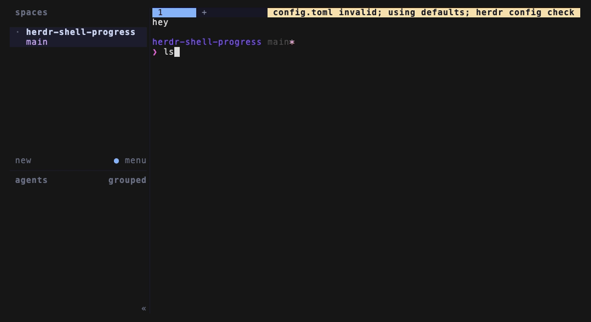

# herdr-shell-progress

Herdr shows live progress for recognized coding agents. A pane running
`cargo build --release` for four minutes shows nothing at all.

This plugin fixes that: slow shell commands report `working` with a ticking
elapsed label, and leave a result behind when they finish.



*`ls` leaves no trace; `sleep 6` crosses the threshold and appears in the
sidebar as `sleep · running 4s`.*

- Fast commands are invisible — nothing flickers when you run `ls`.
- Failures stick until your next command, so you see what broke while away.
- Successes clear themselves after 20 seconds by default.
- Zero socket traffic and zero output for commands under the threshold — with
  one exception: the first command after a sticky failure label spends two
  requests wiping it, however fast that command is.

## Requirements

- Herdr >= 0.7.0
- **zsh** — the hooks are zsh-only (`preexec`/`precmd`). bash and fish are not
  supported; see [Porting to another shell](#porting-to-another-shell).
- **A Rust toolchain** — installation compiles the watcher from source. There
  are no prebuilt binaries.
- macOS or Linux. Developed and tested on macOS; the Rust and zsh sides are both
  portable and Linux should work, but it has not been run there. Reports welcome.

## Install

```bash
herdr plugin install bayoudhi/herdr-shell-progress
```

That runs `cargo build --release` for you.

Now add the hook to your `.zshrc`. Installed plugins live under a
content-hashed directory, so match it with a glob rather than hardcoding a path
that changes on every update:

```zsh
# herdr-shell-progress
() {
  local f=(~/.config/herdr/plugins/github/bayoudhi.shell-progress-*/shell/init.zsh(Nom))
  (( $#f )) && source $f[1]
}
```

Append that to `~/.zshrc` verbatim. It uses zsh glob qualifiers rather than a
subshell, so it costs no fork: `N` makes a missing match empty instead of an
error, and `om` orders newest-first so it keeps working after an update leaves
an older directory behind. If the plugin isn't installed, it does nothing.

Then open a **new** pane — `.zshrc` only runs for new shells — and run
`sleep 5`.

**That block is required.** Installing the plugin alone does nothing: Herdr can
run a plugin's own processes, but only your shell knows when a command starts
and stops, so the hooks have to live in your shell.

<details>
<summary>Installed from a clone, or want to check the path by hand?</summary>

For a `plugin link` install, source your clone directly:

```zsh
source ~/herdr-shell-progress/shell/init.zsh
```

To see the resolved path for an installed copy:

```bash
herdr plugin list --json \
  | python3 -c 'import json,sys;print(next(p["plugin_root"] for p in json.load(sys.stdin)["result"]["plugins"] if p["plugin_id"]=="bayoudhi.shell-progress"))'
```

There is also a `print-snippet` action, but note that
`herdr plugin action invoke` returns an invocation record on stdout and sends
the action's own output to the plugin log — so you would need
`herdr plugin log list --plugin bayoudhi.shell-progress` to read it. The glob
above avoids that entirely.

</details>

### From a clone instead

```bash
git clone https://github.com/bayoudhi/herdr-shell-progress ~/herdr-shell-progress
cd ~/herdr-shell-progress
cargo build --release
herdr plugin link ~/herdr-shell-progress
echo 'source ~/herdr-shell-progress/shell/init.zsh' >> ~/.zshrc
```

`herdr plugin link` deliberately does *not* run build commands, so the
`cargo build` is required here.

## Configure

```bash
herdr plugin config-dir bayoudhi.shell-progress
```

Copy `config.example.toml` into that directory as `config.toml`. Every key is
optional. Changes take effect on your next command — no reload, no restart.

### Ignoring commands

Some commands should never be reported: interactive programs that legitimately
run for hours, and above all coding-agent CLIs. If this plugin reports on a pane
running an agent, it and Herdr's own integration both try to own that pane's
state, and yours wins — hiding what the pane actually is.

Two keys control this, and the difference matters:

```toml
# ADDS to the defaults. This is almost certainly the one you want.
ignore_extra = ["claude-personal", "terraform", "docker"]

# REPLACES the defaults entirely. Setting this drops every built-in entry,
# including the agent CLIs, unless you list them again yourself.
# ignore = ["vim", "less"]
```

Matching is on the **basename of the first word**, exactly. `claude` does not
match `claude-personal` — so a wrapper script, an alias resolving to a different
binary, or a renamed build all need their own entry. If a pane shows a long
"running" label for something that isn't really a shell command, this is why:

```bash
printf 'ignore_extra = ["my-wrapper"]\n' \
  >> "$(herdr plugin config-dir bayoudhi.shell-progress)/config.toml"
```

It applies on your next command — no reload, no restart.

Defaults: `vim`, `nvim`, `less`, `man`, `ssh`, `top`, `htop`, `zsh`, `bash`,
`sh`, `fish`, `claude`, `codex`, `opencode`, `droid`.

## Where shell commands show up

They appear in the sidebar's **agents** list, alongside your coding agents.
That is simply where Herdr shows pane status; a plugin cannot add a section of
its own, and there is no setting to filter or separate them.

What the plugin does do is report a **constant agent id**, `shell`, for every
command. Without that, each distinct command would mint its own agent identity
and your list would fill up with `cargo`, `sleep`, `make`, and every other
binary you ever ran. One id keeps it to a single kind of entry. The row still
shows the actual command name, sent as `display_agent`, which Herdr renders in
preference to the id.

**These entries cannot be restyled.** Herdr's `rows_by_agent` table is validated
against its own canonical agent ids (`claude`, `codex`, `gemini`, and so on) and
rejects anything else. It rejects it by refusing to parse the entire config
file, so adding a rule for this plugin does not merely fail to apply — Herdr
silently falls back to default settings and you lose your keybindings and theme
until you remove it. An earlier version of this README recommended exactly that;
if you followed it, delete the rule and run `herdr config check`.

If you would rather a command never appear at all, that is what
[`ignore_extra`](#ignoring-commands) is for.

### Showing the elapsed label

Herdr's default sidebar rows are:

```toml
rows = [["state_icon", "workspace", "tab"], ["agent"]]
```

There is no `state_text` in there, so out of the box you get the spinner and the
command name but **not** the `running 4s` label — the plugin reports it, and
nothing displays it. To see what the demo above shows, add `state_text` to the
second row in your Herdr `config.toml`:

```toml
[ui.sidebar.agents]
rows = [["state_icon", "workspace", "tab"], ["agent", "state_text"]]
```

Then `herdr config check` and `herdr server reload-config`. This is the plain
`rows` key, which accepts any of Herdr's built-in row fields — unlike
`rows_by_agent` above, it is not restricted to canonical agent ids.

This also affects the finish labels: `ok · 4s`, `exit 1 · 12s`, and `SIGINT · 3s`
all live in `state_text`.

## How it works

`preexec` spawns a detached watcher, using only zsh builtins so the sole cost is
one fork per prompt. The watcher sleeps until the threshold; if the command
finishes first it exits having never touched the socket. Otherwise it reports
via `pane.report_agent` and ticks `pane.report_metadata`. `precmd` writes the
exit code and signals the watcher, which posts the final label and exits.

The watcher writes nothing to stdout or stderr — it inherits the pane's tty, so
any output would corrupt your shell session.

## Porting to another shell

The Rust watcher is shell-agnostic. Everything shell-specific lives in
`shell/init.zsh`, which is about 50 lines, and a port needs to do three things:

1. On command start: write the command line to `<state-dir>/cmd`, then spawn
   `herdr-shell-progress watch --pane "$HERDR_PANE_ID" --shell-pid <shell pid>
   --start-ms <epoch ms> --state-dir <state-dir>`, detached, with both streams
   redirected to `/dev/null`. Pass `--clear-first` if `<state-dir>/marker` exists.
2. On command end: write `$?` to `<state-dir>/exit`, then send `SIGUSR1` to the
   watcher.
3. On shell exit: send `SIGTERM` to the watcher.

bash can do this with `trap DEBUG` plus `PROMPT_COMMAND`, though getting exactly
one spawn per command out of `trap DEBUG` is the fiddly part. PRs welcome.

## Uninstall

```bash
herdr plugin uninstall bayoudhi.shell-progress
```

Use `herdr plugin unlink bayoudhi.shell-progress` instead if you installed from
a clone with `plugin link`.

Then remove the `source` line from `.zshrc`. That line is what actually runs the
plugin, so leaving it behind after uninstalling leaves a dangling `source` that
your shell will complain about on every new pane.
